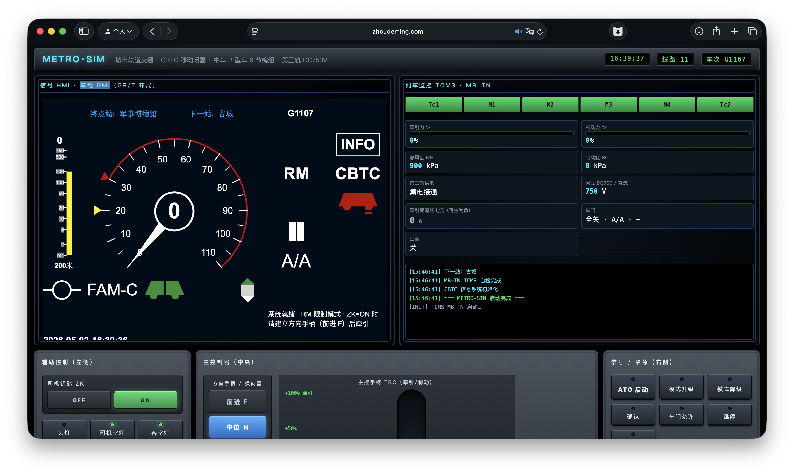
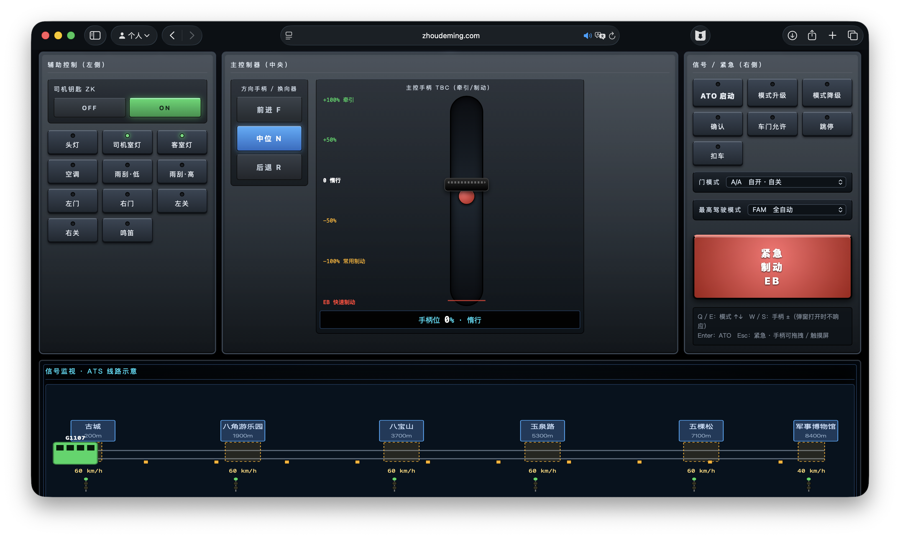
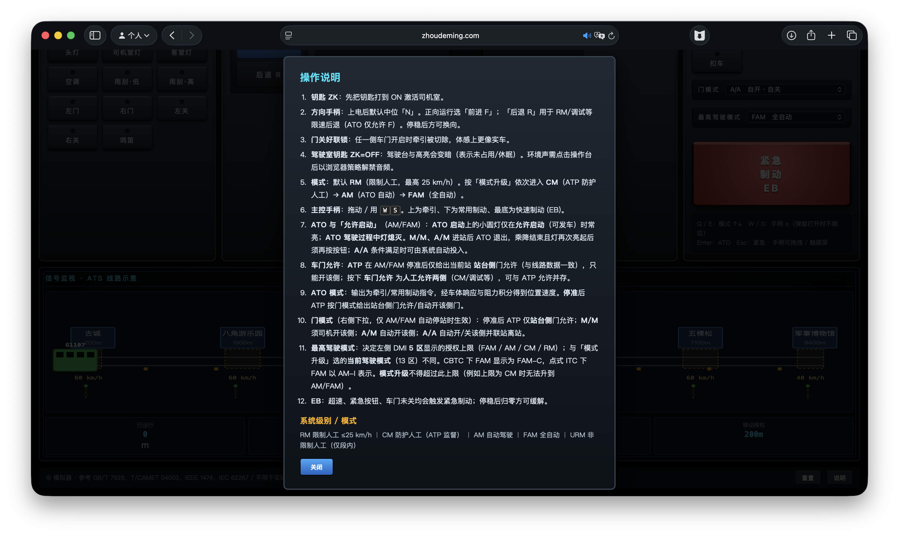

# Beijing Metro Train Driving Simulator

This document also includes a [simplified Chinese version](README.zh-CN.md)

A browser-based driving cab simulator for Beijing Metro Line 19. The current version is based on an 8-car Type A train, DC1500V overhead catenary power, and CBTC moving-block signaling, and combines onboard DMI, TCMS, cab controls, speed-distance curves, ATP/ATO, ATS/OCC control center, and a simplified longitudinal dynamics model.

> For interface demonstration, educational discussion, and interactive experience only. Not intended for actual training, examination, debugging, or operational decision-making.

## Quick Start

This project is a pure static front-end with no build steps or runtime dependencies. It is recommended to open it via a local static server to avoid browser restrictions on ES modules and iframes under `file://`.

\`\`\`bash
python3 -m http.server 8000
\`\`\`

Then visit:

\`\`\`text
http://localhost:8000/          # Driving cab (main interface)
http://localhost:8000/ats-occ/  # ATS control center (standalone page)
\`\`\`

When deploying, keep the full directory structure intact, especially `vobc-dmi/` and `tcms-dmi/`, because the main interface loads these two screens through iframes.

When inspecting screens separately or injecting simulated state, you may also visit directly:

\`\`\`text
http://localhost:8000/vobc-dmi/  # Onboard signal DMI and Zone 25 debugger
http://localhost:8000/tcms-dmi/  # TCMS and stub debugger
\`\`\`

## Simulation Content

### Driving Cab

- Tc1 and Tc2 share one onboard ATP/ATO/TCMS core state while retaining independent driver keys and DMI interfaces. Control authority is first-come, first-served: the other key may still be turned ON, but that cab cannot command traction, braking, or signaling. With both keys ON, VOBC Zone 7 reports local active / opposite cab fault at the controlling end and local fault / opposite cab active at the later end. Once the controlling cab is stopped with the master controller at zero and reverser at N, turning its key OFF transfers authority to the other cab if that key is already ON.
- The right screen is a redesigned TCMS train monitoring interface showing the 8-car Type A consist, next station and terminus, speed, current, line voltage, operating mode, traction/brake percentage, main reservoir/brake cylinder pressure, pantograph status, per-car doors, passenger load, cabin temperature, and real-time event log.
- The lower section is an interactive ATS line and speed-distance chart showing platforms, signals, balises, speed-limited sections, train position, and movement authority, while plotting maximum operating speed, maximum restriction speed, ATP limit speed, recommended speed, ATO operating speed, and EB trigger speed.
- The route map supports zoom in/out, follow train, restore full line, mouse-wheel pivot zoom, and toggling display of individual speed curves and ATO/ATP presets.

### TCMS Train Monitoring and Debugging

- The main interface synchronizes vehicle state to TCMS with about an 80 ms throttle interval. System messages and alarms also write to the TCMS log area.
- Consist display supports 4-, 6-, and 8-car configurations. The current line defaults to the `Tc1-Mp1-M1-Mp3-M3-M2-Mp2-Tc2` 8-car trainset, with five door pairs per side per car.
- The vehicle diagram reflects door open/close, brake state, HSCB/BCM indicators, pantograph position, and train orientation.
- When opening `tcms-dmi/` separately, a stub debugger can adjust speed, line voltage, current, traction/brake, air pressure, operation mode, power supply, HVAC, EB, alarms, doors, train number, and station names.
- The debugger also supports editing each car’s number, door side, pantograph, brake cylinder pressure, tractive effort, passenger load, temperature, and A/B side door IDs, and can inject Info, OK, and Error logs.

### ATS Control Center (OCC)

A standalone dispatch hall workstation interface (`ats-occ/`) opens independently of the driving cab and is used to monitor the full line from the control center perspective.

- Station diagram: Line 19 main line (Mudanyuan — Xingong) double-track schematic, including up/down platforms and platform screen doors, section numbers, signals (including route lock/protect lock coloring), and train numbers.
- Status bar: key equipment status for ATS host, ATP trackside, CI interlocking, DCS communication, plus Beijing time clock.
- Timetable chart: train operation diagram in time–distance format.
- Alarm panel: alarm information table with single/all acknowledge support.
- Yard operations: full-line zoom, train tracking, element name show/hide; yard diagram supports drag panning.
- Return to the driving cab via the top-left “Return to cab” button.

### Section Maximum Restricted Speed Editor

A new “Train operation maximum restricted speed” table appears below the driving cab route map and allows editing each section’s start, end, and absolute speed limit.

- Input validation ensures values are within the full line mileage range and requires `start < end`, non-overlapping sections, and maximum restricted speeds no lower than the section’s maximum operating speed. Uncovered ranges may remain empty.
- After clicking “Apply”, ATP, ATO, DMI, and speed curves all adopt the new limits. Exceeding the absolute limit triggers emergency braking.
- Clicking “Reset to default” regenerates default limits from the route profile and clamps them to the current 100 km/h operating ceiling.
- System reset also restores the default speed limit table and full-line view.

### Control Equipment

- Left auxiliary panel: driver key ZK with position feedback, headlights, cab light, passenger compartment light, air conditioning, wiper low/high speed, left/right door open, left/right door close, and horn.
- Central control panel: direction handle F/N/R and master controller TBC, supporting traction, coasting, service brake, and emergency brake.
- Right signal panel: ATO start, mode upgrade/downgrade, confirmation, door release, trip reset, trip inhibit, door mode, highest driving mode, and emergency brake buttons.
- The train must stop and the master controller must return to zero before changing direction; in N position, the master controller may only remain at zero.

### Driving Modes

- `RM`: restricted manual mode, maximum 25 km/h.
- `CM`: manual driving under ATP protection.
- `AM`: ATO automatic driving, following the recommended speed curve and automatically aligning for station stopping.
- `FAM`: fully automatic mode, which can automatically open and close doors and continue running under A/A door mode.

## Basic Operation

1. Confirm the driver key `ZK` is `ON`.
2. Set the direction handle to `Forward F`.
3. The cab enters `RM` by default and can be switched to `CM`, `AM`, or `FAM` via the mode upgrade button.
4. In manual driving, drag the master controller upward for traction and downward for braking.
5. In `AM` or `FAM`, when the controller is at zero, doors are closed, no EB is active, no trip reset is active, and movement authority is granted, press “ATO Start.”
6. At stations, open doors according to door mode and ATP permission; after boarding and alighting, close doors and wait for departure authorization before continuing.
7. If EB triggers, the train applies emergency braking; after stopping and returning the controller to zero, press the EB button again to release.

## Shortcuts

- `W` / `S`: increase or decrease the master controller by 10%.
- `Q` / `E`: upgrade or downgrade driving mode.
- `Enter`: ATO start.
- `Esc`: emergency brake or release.
- `H`: horn.

## System Features

- The train model references Beijing Metro Line 19’s 8-car Type A train with overhead catenary DC1500V power.
- The signaling system references CBTC moving-block logic, including absolute section limits, ATP dynamic limit speed, maximum service brake trigger speed, EB trigger curve, and station stopping profile.
- ATP’s EB curve includes a 1.2 s system/vehicle response delay, emergency braking rate guarantee, and speed measurement error margin. AM/FAM may first apply maximum service braking; CM retains manual speed control and uses EBI as protection.
- ATO outputs traction/brake acceleration only; train position and speed are integrated by the physics engine and do not directly correct train coordinates. Commands include vehicle response filtering and jerk-rate limiting.
- ATO uses a four-stage control strategy: traction acceleration, fluctuation-band cruise, curve braking, and low-speed creeping, and calculates the speed profile from upcoming slowdown points and station stops.
- The normal ATO schedule targets 85% of each section ceiling, reserving recovery margin; the A/A dwell baseline is 35 s and the end-to-end timing is calibrated around 30 minutes.
- Station alignment tolerance is about ±30 cm; if outside the window but within 5 m, the system may adjust in forward/backward jumps not exceeding 5 km/h, up to three times. In FAM, overshoot beyond 1 m triggers EB; after stopping, the system either automatically corrects or waits for manual handling depending on the deviation.
- A/A supports automatic door open/close and departure; while trip reset is active, doors and platform doors remain linked and held, and the system exits ATO after destination boarding is complete.
- Door control supports `M/M`, `A/M`, and `A/A`, distinguishing ATP platform-side door release from manual both-side door release.
- The simplified physics model includes estimated 8-car Type A empty mass and passenger load, constant-power traction fade above 40 km/h, grade and curve resistance, rolling and aerodynamic resistance, blended electric/pneumatic braking, low-speed regenerative fade, and brake build-up lag.

### Line 19 Route Data

Forward `F` runs in the direction of increasing mileage from Mudanyuan to Xingong. The model preserves both published conventions: 22.4 km and 120 km/h as project/design figures, while the driving simulation uses the 20.9 km operating coordinate and a 100 km/h operating ceiling. Unknown platform, grade, curve, signal, and balise details are explicit estimated data rather than generated site-accurate claims.

| No. | Station | Cumulative Mileage | Section Length |
| ---: | --- | ---: | ---: |
| 1 | Mudanyuan | 0 m | — |
| 2 | Beitaipingzhuang | 920 m | 920 m |
| 3 | Jishuitan | 3,370 m | 2,450 m |
| 4 | Ping’anli | 4,960 m | 1,590 m |
| 5 | Taipingqiao | 7,670 m | 2,710 m |
| 6 | Niujie | 9,810 m | 2,140 m |
| 7 | Jingfengmen | 12,770 m | 2,960 m |
| 8 | Caoqiao | 15,450 m | 2,680 m |
| 9 | Xinfadi | 18,100 m | 2,650 m |
| 10 | Xingong | 20,840 m | 2,740 m |

The operating coordinate ends at 20,900 m. The estimated baseline uses 60 km/h station zones, 100 km/h ordinary interstation zones, and a 40 km/h terminal zone. The train starts at Mudanyuan with Beitaipingzhuang as the next stop.

## Key Parameters

- Maximum traction acceleration: `1.0 m/s²`
- Vehicle design speed: `120 km/h`
- Current operating ceiling: `100 km/h`
- Maximum service braking: `1.1 m/s²`
- Emergency/quick braking: `1.3 m/s²`
- RM speed limit: `25 km/h`
- ATP overspeed EB margin: limit + `5 km/h`
- ATO station alignment tolerance: about `±30 cm`
- Simulation main loop: `30 Hz`

## Directory Structure

\`\`\`text
metro-simulator/
├── index.html                  # Main driving cab page
├── style.css                   # Main interface styles
├── vobc-dmi/
│   └── index.html              # Onboard signal DMI
├── tcms-dmi/
│   └── index.html              # TCMS screen
├── ats-occ/
│   ├── index.html              # ATS control center (OCC)
│   ├── occ.js                  # Yard diagram rendering and interaction
│   └── occ.css                 # OCC styles
├── js/
│   ├── main.js                 # Entry point, main loop, and DOM event bindings
│   ├── config/                 # Simulation constants
│   ├── lib/                    # DOM and math utilities
│   ├── systems/                # vehicle, ATP, ATO, speed limit, door, station, and physics models
│   ├── audio/                  # beeps and ambient sounds
│   └── ui/                     # instrument rendering, DMI bridge, route view, and speed limit editor
├── images/demo/                # README screenshots
├── tmp/docs/                   # text excerpts of ATP/ATO/FAO reference materials
├── LICENSE
└── README.md
\`\`\`

## Updates (v0.1.2)

The following is a complete summary of feature changes relative to the `main` branch.

### Route and Train Configuration

- The simulated object was changed from a generic 6-car Type B train with a DC750V third rail to Beijing Metro Line 19’s 8-car Type A train with DC1500V overhead catenary.
- The route was changed to Mudanyuan—Xingong with 10 stations, the current model station sequence and specific section lengths were written in, and train number `19005`, terminus, section speeds, signals, balises, and full line mileage were synchronized.
- Route names, train consist, power supply type, and voltage display were synchronized across the main driving cab, DMI, TCMS, ATS route map, and OCC.

### Driving Cab and Route View

- Redesigned the driving cab layout and styling, added mechanical driver key position feedback, low/high wiper controls, independent left/right door close buttons, and corrected ATO running lights, handle states, and power supply status display.
- Added direction-change safety conditions: the train must be stopped and the master controller must be returned to zero; N position forbids traction/brake output.
- Extended the ATS route map into a speed-distance integrated view, adding six types of speed curves, real-time speed/position markers, curve toggles, ATO/ATP display presets, section zoom, mouse-wheel zoom, train follow, and full-line reset.
- Added an editable section maximum restricted speed table with validation for section overlap and numeric range; after applying, ATP/ATO/DMI/curves synchronize and exceeding limits directly triggers EB.
- Added system event log forwarding to the main interface and TCMS, recording startup, alignment, door control, trip reset, alarms, speed limit changes, and resets.

### ATP, ATO, and Physics Model

- Rewrote the speed supervision chain and station control based on the “Urban Rail Transit Train Operation Speed Control Guide,” “Urban Rail Transit Full Automatic Operation System Construction Guide,” and GB/T 12758-2023.
- ATP five-level supervision chain: train maximum operating speed → train maximum restricted speed → ATP system limit speed → maximum service brake trigger speed → emergency brake trigger speed. The EB curve includes 1.2 s response delay, braking rate guarantee, and 5 km/h speed measurement error margin.
- Mode-specific intervention: when AM/FAM exceed the service brake trigger speed, ATP first applies maximum service braking, and emergency braking triggers once the EB threshold or absolute limit is reached; CM maintains manual speed control with EBI as the final safeguard.
- ATO four-stage control: traction acceleration → ±2 km/h fluctuation-band cruise → curve-based braking → final low-speed creeping alignment; upcoming slowdown sections and station stops are unified into the operational speed profile, and commands include jerk-rate limiting.
- Jump alignment: the station alignment window is about ±30 cm. Outside the window but within 5 m, the system may adjust forward/backward in jumps not exceeding 5 km/h, up to three times; beyond that it holds the brake and alarms.
- Overshoot protection: in FAM, overshooting by more than 1 m automatically triggers EB; after stopping, if the deviation is within 5 m the system automatically relieves EB and adjusts backward, while deviations over 5 m keep EB and wait for manual handling.
- Platform operations: A/A supports automatic door open/close and departure; when trip reset is active, doors and platform doors relink and remain held, and ATO exits after destination boarding is complete.
- Rewrote brake build-up, zero-speed hold, reverse operation, station stopping, and manual braking stopping logic in the longitudinal dynamics model to eliminate phantom reverse traction near zero due to filtering residue.

### TCMS

- The TCMS operation page was completely redesigned for the 8-car Type A consist, adding per-car door display, braking, HSCB/BCM, pantograph, pressure, traction/electric braking force, passenger load, temperature, speed alarms, and operating status.
- Added a real-time log area and parent-page log message protocol, updating synchronization logic for line voltage, current, mode, doors, HVAC, EB, holding brake, and station name.
- Added an independent stub debugger that can switch 4/6/8 car configurations and 4/5 door pairs per side, adjust A/B side layout, and edit per-car status and door numbering.
- Redesigned vehicle body, doors, brake discs, pantograph, status table, force table, and bottom menu styling, and removed the old layout watermark.

### DMI and OCC

- DMI now includes the locked black screen and real-time clock when the driver key is off, and improved synchronized display for RM/CBTC level, traction/brake, holding brake, recommended speed, EB speed, door status, and alarms.
- Added a standalone `ats-occ/` control center: includes Line 19 double-track station diagram, up/down platforms and platform doors, sections/signals/train numbers, equipment status, operation chart, alarm acknowledgement, full-line zoom, train tracking, name show/hide, and drag interaction.
- The OCC remains available as a standalone `/ats-occ/` page; its main-cab entry is currently hidden, while the OCC page still links back to the cab.

### Engineering and Documentation

- Added text excerpts of ATP/ATO/FAO reference materials and OCC page validation screenshots, making it easier to trace the implementation basis for the speed supervision and fully automatic operation logic.
- Updated `.gitignore` to ignore the local `.cursor/` configuration directory.

## References and Disclaimer

The interface and logic reference publicly available urban rail transit cab, CBTC/ATP/ATO, TCMS, and metro vehicle designs, including standards and technical references such as GB/T 7928, T/CAMET 04003, IEEE 1474, IEC 62267, and others. The project implementation is simplified and artistic, and does not represent any real manufacturer equipment, line data, or operating procedures.

## License

The original source code and documentation are licensed under the [MIT License](LICENSE).

Some audio assets use separate, non-open-source permissions and are excluded from the MIT License:

- `assets/announcements/emergency/` — Copyright © 2022 TechApogeeS. See its [LICENSE](assets/announcements/emergency/LICENSE).
- `assets/announcements/stations/` — Copyright © 2022 Brick_Hans. See its [LICENSE](assets/announcements/stations/LICENSE).

See [NOTICE](NOTICE) for the complete license scope.
